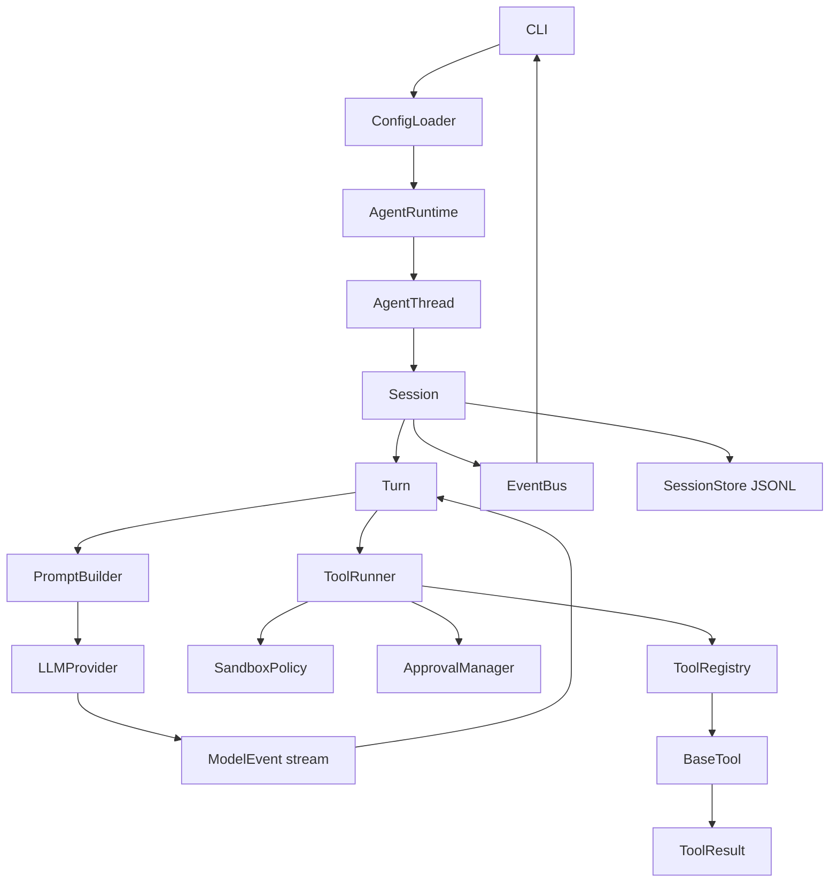

# Architecture

This document describes the current CodeCraft v1.0 runtime architecture. The detailed source-of-truth design is `docs/design/codecraft-runtime-sdd.md`; this file is a shorter implementation-oriented map.

## Goals

CodeCraft is a local coding-agent runtime. Its job is not to hide model APIs, but to make agent execution governable:

- keep session state explicit and recoverable;
- stream model output as runtime events;
- route every tool call through one execution path;
- enforce workspace, sandbox, and approval boundaries before side effects;
- persist a JSONL event log that can be inspected and resumed;
- keep CLI/TUI/future app surfaces outside the core runtime.

## Runtime Flow



The important invariant is that execution happens inside `Session` and `Turn`. CLI submits inputs and renders events; it does not run the agent loop itself.

## Core Modules

### `AgentRuntime`

`AgentRuntime` wires together:

- `SessionStore`
- `LLMProviderRegistry`
- `ToolRegistry`
- `ApprovalManager`

It creates and resumes `AgentThread` instances. It does not render CLI output, call tools directly, or parse model provider responses.

### `AgentThread`

`AgentThread` is the public session facade for CLI and future UI layers. It exposes:

- `submit(SessionInput)`
- `next_event()`
- `events()`
- `interrupt()`
- `close()`
- `read_snapshot()`
- pending approval inspection for interactive reviewers

The thread captures events from the session `EventBus` and hands them to consumers without exposing internal session mutation.

### `Session`

`Session` owns long-lived runtime state:

- conversation history
- input queue
- active turn
- event sequence number
- status
- event bus
- session store

`Session.emit()` is the single event creation path. It assigns monotonically increasing `seq`, writes the event to `SessionStore`, then publishes it through `EventBus`.

### `Turn`

`Turn` runs one user input to completion. Its loop is:

1. emit `turn_started` and `user_message`;
2. build model messages with `PromptBuilder`;
3. consume `LLMProvider.stream()`;
4. emit assistant deltas, tool calls, token counts, errors, and final messages;
5. dispatch tool calls through `ToolRunner`;
6. append tool call/results back into conversation;
7. emit `turn_finished` or `turn_aborted`.

The turn is also responsible for reconstructing the assistant message from streaming deltas when the provider does not emit a final completed message.

### `SessionStore`

`SessionStore` stores JSONL logs under:

```text
~/.codecraft/sessions/YYYY/MM/DD/<session_id>.jsonl
```

It supports create, append, load, list, raw-line inspection, and resume. The JSONL log is the fact source for audit and recovery.

### `Conversation` And Resume

Resume reconstructs conversation from existing runtime events instead of replaying old tools. It restores:

- user messages
- assistant messages
- model tool calls
- tool results
- context compaction summaries when present

This keeps historical side effects from running twice.

## LLM Providers

Providers implement:

```python
async def stream(messages, tools, context) -> AsyncIterator[ModelEvent]
```

Current providers:

- `mock` for tests
- `openai`
- `qwen`
- `deepseek`

OpenAI uses the Responses-style compatible path. Qwen and DeepSeek use OpenAI-compatible Chat Completions streaming and translate `choices[].delta.content` into `MESSAGE_DELTA` events. Tool call argument chunks are accumulated before emitting a complete `TOOL_CALL`.

Provider connection configuration comes from `SessionConfig`:

- `model_provider`
- `model`
- `model_api_key_env`
- `model_base_url`

If `api_key_env` is not configured, provider defaults are applied by the CLI runtime builder: Qwen uses `DASHSCOPE_API_KEY`, DeepSeek uses `DEEPSEEK_API_KEY`, and OpenAI uses `OPENAI_API_KEY`.

## Tool System

### `BaseTool`

Each tool declares:

- `name`
- `description`
- Pydantic `args_schema`
- `effects`
- `requires_approval`

Tools return `ToolResult`; expected tool failures should be expressed as failed `ToolResult` values instead of crashing the process.

### `ToolRegistry`

`ToolRegistry` indexes tools by name and exposes `ToolSpec` schemas to providers. It does not execute tools and does not make approval decisions.

### `ToolRunner`

`ToolRunner` is the only execution entrance for tools. The order is:

1. emit `tool_call_started`;
2. resolve the tool;
3. validate arguments;
4. evaluate `SandboxPolicy`;
5. evaluate/request approval through `ApprovalManager`;
6. call `tool.arun()`;
7. catch known and unknown errors into `ToolResult`;
8. emit `tool_call_finished`;
9. emit `patch_applied` for successful `apply_patch`.

This keeps side-effect governance in one place.

## Built-In Tools

| Tool | Effect | Notes |
| --- | --- | --- |
| `read_file` | `read_only` | reads text inside workspace |
| `list_files` | `read_only` | lists workspace entries, skipping noisy folders |
| `workspace_search` | `read_only` | searches workspace paths and text content for repository-aware context |
| `write_file` | `workspace_write` | requires approval |
| `apply_patch` | `workspace_write` | requires approval, emits patch metadata |
| `bash` | `process_exec` | command policy + approval |

`WorkspaceGuard` prevents filesystem path escape for workspace tools and bash cwd.

## Approval And Sandbox

CodeCraft v1.0 uses application-level safeguards. It does not claim OS-level sandboxing.

`SandboxPolicy` enforces coarse execution boundaries:

- `read_only` allows read-only tools only;
- `workspace_write` allows workspace writes and process execution, still subject to approval and command policy;
- `danger_full_access` is represented in config for future expansion;
- network effects are denied when `network_access=false`.

`ApprovalManager` handles human-in-loop policy:

- `never`
- `on_request`
- `untrusted`

For bash, `CommandPolicy` classifies safe, prompt-required, denied, and network commands. Network commands are denied when `network_access=false`.

## Prompt And Instructions

`PromptBuilder` creates a system message from:

```text
base_instructions
project_instructions
user_instructions
turn_context
```

Project instructions come from `AGENTS.md` and `CODECRAFT.md`, searched upward from the cwd without crossing the workspace root. Tool schemas are not written into the prompt; providers receive them as structured `tools`.

## CLI Layer

The Typer CLI supports:

- `codecraft exec`
- `codecraft chat`
- `codecraft resume --last`
- `codecraft sessions`
- `codecraft inspect`
- `codecraft trace`
- `codecraft eval`
- `codecraft index`
- `codecraft retrieval-eval`

CLI responsibilities are config loading, runtime construction, input submission, approval prompting, and event rendering. Core runtime modules do not depend on CLI code.

## Evaluation Suite

`codecraft.eval` provides a stable 10-task suite for measuring repository-agent
behavior. The runner creates an isolated workspace for each task, executes it
through the normal `AgentRuntime`, grades the resulting files with deterministic
checks, and writes aggregate JSON/HTML reports plus a JSON trace per attempt.

`--repeat` creates a clean workspace and session for every task attempt. Aggregate
reports include per-task success rates, p50/p95 duration, normalized token usage,
tool failures, and failure categories. Compatible providers emit token usage before
tool-call events so a turn cannot drop usage when it pauses the model stream to run
a tool.

The repository does not currently publish a real-provider evaluation baseline.
Automated tests validate the evaluation path with `MockProvider`; real model runs
remain an explicit follow-up because they consume external API credits.

The suite intentionally uses the same read, list, workspace search, write, and
patch tools as normal sessions. Bash and network access are excluded from eval
workspaces, so benchmark prompts cannot execute arbitrary processes. The generated
workspaces are preserved in the report directory for failure diagnosis.

## Retrieval Evaluation

`codecraft.retrieval` defines a stable multi-language corpus and ten fixed queries
that execute through the public `workspace_search` tool. `codecraft retrieval-eval`
does not load a model or consume API credits. It writes JSON and HTML reports with
Recall@1, Recall@5, Precision@5, MRR, p50/p95 latency, scanned files and bytes,
irrelevant paths, returned context size, and per-query results.

`WorkspaceSearchTool` is an adapter over `ContextEngine`; it owns tool argument
validation and result formatting but not retrieval. The engine holds named
retrievers and defaults to the deterministic `ScanRetriever`. `LexicalRetriever`
uses SQLite FTS5/BM25 over bounded chunks, while `SymbolRetriever` queries symbols
extracted from Tree-sitter syntax trees. This keeps the public tool contract stable
while retrieval implementation and routing evolve independently.

`codecraft index` writes databases to
`~/.codecraft/indexes/<workspace-id>/index.sqlite3`. Sync compares file metadata and
content digests, reparses only changed files, and removes deleted files. Index
queries validate the current size and modification time of matched files; an absent
or stale-only result falls back to `ScanRetriever`. Explicit indexing keeps full
repository walks out of foreground search latency. Successful `write_file` and
`apply_patch` executions pass through a `ToolResultObserver` that refreshes only the
reported changed paths; observer failures are diagnostic metadata and never change
the already-completed tool result.

`QueryRouter` maps query shape to a sequential plan: path queries prefer indexed
path lookup, identifier-shaped queries try symbol then lexical retrieval, natural
language prefers lexical retrieval, and short exact phrases prefer scan. The engine
stops at the first non-empty response and records both the route reason and attempted
retrievers. This avoids unconditional fan-out while retaining deterministic scan
fallbacks.

The initial benchmark records the behavior of the existing deterministic scan
backend, including known failures on semantic-only queries. Future context-engine
implementations can keep the tool contract and run the same suite, so indexing,
routing, fusion, and reranking changes are compared against an explicit quality and
cost baseline rather than assumed to be improvements.

## Current Limitations

- No OS-level sandbox.
- No Web/GitHub/cloud tools in v1.0 scope.
- `resume --last` resumes the latest valid session; explicit interactive resume by session id is not implemented.
- Context compaction is represented in event/reconstruction paths, but full automatic compaction is v1.1 work.
- There is no automatic pruning or repair for invalid session logs yet.
- Agent file writes refresh an existing index automatically. External edits are
  detected for returned indexed hits, but newly added external files require
  another `codecraft index` run.
- Retrieval has lexical ranking and symbol lookup but no graph or semantic retriever.
