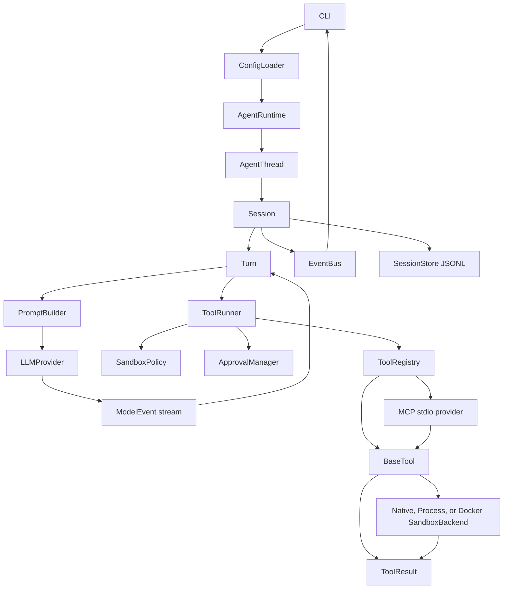

# Architecture

This document is the source of truth for the current CodeCraft v1.0 runtime architecture.

## Goals

CodeCraft is a local coding-agent runtime. Its job is not to hide model APIs, but to make agent execution governable:

- keep session state explicit and recoverable;
- stream model output as runtime events;
- route every tool call through one execution path;
- enforce workspace, sandbox, and approval boundaries before side effects;
- persist a JSONL event log that can be inspected and resumed;
- keep CLI/TUI/future app surfaces outside the core runtime.

## Runtime Flow



The important invariant is that execution happens inside `Session` and `Turn`. CLI submits inputs and renders events; it does not run the agent loop itself.

## Core Modules

### `AgentRuntime`

`AgentRuntime` wires together:

- `SessionStore`
- `LLMProviderRegistry`
- `ToolRegistry`
- `ApprovalManager`

It creates and resumes `AgentThread` instances. It does not render CLI output, call tools directly, or parse model provider responses.

### `AgentThread`

`AgentThread` is the public session facade for CLI and future UI layers. It exposes:

- `submit(SessionInput)`
- `next_event()`
- `events()`
- `interrupt()`
- `close()`
- `read_snapshot()`
- pending approval inspection for interactive reviewers

The thread captures events from the session `EventBus` and hands them to consumers without exposing internal session mutation. It is an in-memory handle, not a second persisted identity; `session_id` is the sole identifier for the conversation and its event log.

### `Session`

`Session` owns long-lived runtime state:

- conversation history
- input queue
- active turn
- event sequence number
- status
- event bus
- session store

`Session.emit()` is the single event creation path. It assigns monotonically increasing `seq`, writes the event to `SessionStore`, then publishes it through `EventBus`.

The session also owns the active turn task. `interrupt()` and `close()` cancel that task and wait for its cleanup before exposing an idle or closed state. `turn_timeout_seconds` is enforced at this ownership boundary, so provider, tool, and observer work cannot outlive the turn deadline. State transitions are serialized so a cancelled turn cannot start a queued turn after the session has closed, and `session_closed` is always emitted after the active turn's terminal event.

### `Turn`

`Turn` runs one user input to completion. Its loop is:

1. emit `turn_started` and `user_message`;
2. build model messages with `PromptBuilder`;
3. consume `LLMProvider.stream()`;
4. emit assistant deltas, tool calls, token counts, errors, and final messages;
5. dispatch tool calls through `ToolRunner`;
6. append tool call/results back into conversation;
7. emit `turn_finished` or `turn_aborted`.

The turn reconstructs the assistant message from streaming deltas. Every provider response must end with an explicit `COMPLETED` event and must contain either non-empty assistant text or at least one valid `ToolCall`; incomplete or empty responses abort with `model_protocol_error`.

A provider response may contain multiple tool calls. `Turn` validates and records the complete ordered batch before executing any call, appends results in the same order, and only then requests the next model response. Batches composed entirely of approval-free `read_only` tools run with bounded concurrency; mixed, write, process, network, and approval-bearing batches remain serial. Chat Completions adapters serialize the batch as one assistant message with multiple `tool_calls`. `max_tool_calls` counts attempted calls, rejects an over-budget batch before any part of it runs, records the rejected request in abort metadata, and still permits a final model response after the exact limit is reached.

### `SessionStore`

`SessionStore` stores JSONL logs under:

```text
~/.codecraft/sessions/YYYY/MM/DD/<session_id>.jsonl
```

It supports create, append, load, list, raw-line inspection, and resume. The JSONL log is the fact source for audit and recovery.

Persisted `RuntimeEvent` and embedded `SessionConfig` objects carry independent schema versions. Missing or unknown versions are rejected explicitly instead of being partially restored with different semantics. Before the first release, schema changes replace the current version directly.

### `Conversation` And Resume

Resume reconstructs conversation from existing runtime events instead of replaying old tools. It restores:

- user messages
- assistant messages
- model tool calls
- tool results
- exact post-compaction conversation snapshots when present

This keeps historical side effects from running twice.

Before each provider request, `Turn` measures the serialized provider-neutral
message and tool payload against `max_context_chars`. It replaces older complete
turns with a deterministic summary while retaining the current user turn and its
complete function-call protocol. `context_compacted` persists both the summary
and exact compacted conversation snapshot, so resume reconstructs the context
that was actually sent rather than regenerating a summary.

## LLM Providers

Providers implement:

```python
async def stream(messages, tools, context) -> AsyncIterator[ModelEvent]
```

Current providers:

- `mock` for tests
- `openai`
- `qwen`
- `deepseek`

OpenAI uses the Responses-style compatible path. Qwen and DeepSeek use OpenAI-compatible Chat Completions streaming and translate `choices[].delta.content` into `MESSAGE_DELTA` events. Tool call argument chunks are accumulated before emitting a complete `TOOL_CALL`.

`ModelEvent` payloads are validated by event type. Providers must supply non-empty text, normalized tool identities and arguments, non-negative token counts, and an explicit terminal event; `Turn` does not contain provider-specific field aliases or generated fallback call IDs.

Provider connection configuration comes from `SessionConfig`:

- `model_provider`
- `model`
- `model_api_key_env`
- `model_base_url`

If `api_key_env` is not configured, provider defaults are applied by the CLI runtime builder: Qwen uses `DASHSCOPE_API_KEY`, DeepSeek uses `DEEPSEEK_API_KEY`, and OpenAI uses `OPENAI_API_KEY`.

## Tool System

### `BaseTool`

Each tool declares:

- `name`
- `description`
- Pydantic `args_schema`
- `effects`
- `requires_approval`

Built-in argument models inherit from a strict `ToolArguments` base and reject unknown fields. MCP arguments remain governed by each remote JSON Schema, including its `additionalProperties` policy. Tools return `ToolResult`; expected tool failures use stable error codes instead of crashing the process or exposing raw exception text.

### `ToolRegistry`

`ToolRegistry` indexes tools by name and exposes `ToolSpec` schemas to providers. It does not execute tools and does not make approval decisions.

The registry also owns lifecycle-managed `AsyncToolProvider` instances. `start()` discovers all provider tools and validates the complete name set before registering any of them. A startup failure closes already-started providers without exposing a partial tool set. `close()` removes dynamic tools and releases provider connections.

### `ToolRunner`

`ToolRunner` is the only execution entrance for tools. The order is:

1. emit `tool_call_started`;
2. resolve the tool;
3. validate arguments;
4. evaluate `SandboxPolicy`;
5. evaluate/request approval through `ApprovalManager`;
6. call `tool.arun()`;
7. catch known and unknown errors into `ToolResult`;
8. emit `tool_call_finished`;
9. emit any typed runtime events declared by the tool result.

This keeps side-effect governance in one place.

## Built-In Tools

| Tool | Effect | Notes |
| --- | --- | --- |
| `read_file` | `read_only` | reads text inside workspace |
| `list_files` | `read_only` | lists workspace entries, skipping noisy folders |
| `workspace_search` | `read_only` | searches workspace paths and text content for repository-aware context |
| `write_file` | `workspace_write` | requires approval |
| `apply_patch` | `workspace_write` | requires approval, emits patch metadata |
| `bash` | `process_exec` | command policy + approval + pluggable process sandbox |

`WorkspaceGuard` prevents filesystem path escape for workspace tools and bash cwd.

`ToolRunner` applies `max_tool_output_chars` to model-facing content, structured data, metadata, and tool-emitted event payloads after observers run and before persistence. `ToolResult.model_content()` adds stable failure codes, recovery suggestions, and explicit truncation markers to the text returned to the model; reconstruction uses the same method. Tool execution and approval use independent deadlines. Every `tool_call_finished` event includes governance, approval wait, execution, observer, and total phase timings. Independent observers run concurrently but finish before the result is persisted, preserving event-log consistency.

## Approval And Sandbox

CodeCraft uses layered safeguards rather than treating one mechanism as the complete sandbox:

1. `SandboxPolicy` gates tool effects by configured capability mode.
2. `ApprovalManager` applies the human-in-the-loop policy.
3. Bash `CommandPolicy` classifies safe, prompt-required, denied, and network commands.
4. `SandboxBackend` executes an approved bash command in a native OS sandbox, an explicitly unsafe host process, or Docker.

`SandboxPolicy` enforces coarse execution boundaries:

- `read_only` allows read-only tools only;
- `workspace_write` allows workspace writes and process execution, still subject to approval and command policy;
- `danger_full_access` adds no mode-based effect restrictions;
- network effects are denied when `network_access=false`.

`ApprovalManager` handles human-in-loop policy:

- `never`
- `on_request`
- `untrusted`

The active policy has one source: `TurnContext.approval_policy`, copied from the persisted `SessionConfig`. `ApprovalManager` carries only the reviewer and command classifier. Bash commands are classified once from validated arguments; the resulting `CommandDecision` is passed through `ToolContext` to `BashTool`, so approval and execution cannot drift between separate classifiers.

Persisted runtime payloads recursively redact values under common credential field names. Configuration keys that name environment variables remain visible, while actual API keys, tokens, passwords, cookies, and secrets in nested tool arguments are replaced before they reach the event log or UI event stream.

The default `auto` selection uses `SeatbeltSandboxBackend` on macOS and `BubblewrapSandboxBackend` on Linux. Both enforce workspace writes and disabled networking at the OS boundary for the full bash process tree. Linux fails closed when `bwrap` is unavailable. `ProcessSandboxBackend` is an explicit no-isolation escape hatch, not a sandbox. All host-process backends receive a sanitized environment and a private temporary home; additional variables require `sandbox.env_allowlist`.

Sandbox code is split by responsibility: `backend.py` defines the execution contract, `_execution.py` owns shared process lifecycle and validation, `factory.py` resolves configured backends, and `process.py`, `seatbelt.py`, `bubblewrap.py`, and `docker.py` contain platform-specific adapters. Platform modules depend on the contract and shared execution primitives; the contract does not depend on concrete backends.

The optional `DockerSandboxBackend` creates an ephemeral container per command with workspace-only bind mounts, a read-only root filesystem, bounded tmpfs, host UID/GID, dropped capabilities, `no-new-privileges`, CPU/memory/PID limits, explicit environment forwarding, and no container network when `network_access=false`. It never pulls an image implicitly and force removes timed-out containers.

Native and Docker backends isolate the bash process but do not make a writable workspace immutable. Built-in file tools still execute on the host behind `WorkspaceGuard`, and command policy plus approval remain in force for every backend.

## MCP Client

`MCPStdioProvider` uses the official stable Python SDK to start a configured stdio server, initialize one persistent `ClientSession`, follow paginated tool discovery, and adapt each remote tool into a normal `BaseTool`. `AgentRuntime.create_thread()` and `resume_thread()` start the registry before a session is exposed; CLI and eval paths close the runtime deterministically.

MCP tools use a provider-safe `mcp__<server>__<tool>` namespace. Their remote JSON Schema is returned to model providers and independently enforced through a generated Pydantic argument model backed by JSON Schema 2020-12 validation. Calls still execute through `ToolRunner`, so sandbox effects, approval events, duration, result normalization, and trace persistence remain unchanged.

Server annotations are untrusted hints. Governance comes from local configuration: default tools carry `network` and `external` effects and require approval, while per-tool settings can declare a narrower policy. Text, structured content, resource links, and embedded text are normalized; image, audio, and blob payloads are summarized to keep logs bounded.

A configured stdio server is an explicitly trusted host process. CodeCraft limits inherited environment variables but does not currently launch that server through `DockerSandboxBackend`; `network_access` can deny calls declared with a network effect, not revoke networking from the server process itself.

## MCP Server

`create_repository_mcp_server()` builds a read-only FastMCP server around one explicit workspace. The `codecraft mcp-server` CLI command runs it over stdio without writing non-protocol output to stdout.

The server exposes `search_repository`, `codecraft://workspace/metadata`, and `codecraft://workspace/instructions`. Search executes through the same `ContextEngine` and repository index used by the built-in workspace tool. Every requested search root passes through `WorkspaceGuard`, and the server exposes no write, patch, bash, approval, session, or agent-loop surface.

Tool output is a Pydantic structured result containing matches, routing, fallback, truncation, and scan-cost metrics. This allows an external MCP host to consume repository context without scraping human-formatted CLI output. A real stdio interoperability test starts the CLI server through `MCPStdioProvider` and calls it through `ToolRunner`.

## Prompt And Instructions

`PromptBuilder` creates a system message from:

```text
base_instructions
project_instructions
user_instructions
turn_context
```

Project instructions come from `AGENTS.md` and `CODECRAFT.md`, searched upward from the cwd without crossing the workspace root. Bootstrap resolves them once into `SessionConfig`; `PromptBuilder` performs no filesystem I/O, so resumed sessions retain the original instruction snapshot. Tool schemas are not written into the prompt; providers receive them as structured `tools`.

## CLI Layer

The Typer CLI supports:

- bare `codecraft` for the interactive TUI
- `codecraft exec`
- `codecraft sessions`
- `codecraft inspect`
- `codecraft trace`
- `codecraft eval`
- `codecraft index`
- `codecraft retrieval-eval`
- `codecraft mcp-server`

CLI responsibilities are config loading, runtime construction, one-shot input submission, approval prompting, diagnostics, evaluation, indexing, and service commands. Multi-turn human interaction and session continuation belong to the TUI. Core runtime modules do not depend on CLI code.

## TUI Layer

`CodeCraftTUI` is a Textual presentation layer over `AgentRuntime` and `AgentThread`. It creates or resumes a normal session, submits `SessionInput`, and consumes the same persisted `RuntimeEvent` stream used by non-interactive CLI execution. It does not call model providers or tools directly.

The TUI package separates coordination (`app`), modal screens (`screens`), reusable message widgets (`widgets`), presentation formatting (`rendering`), and Textual styles (`codecraft.tcss`). These modules remain presentation-only and do not introduce a second runtime API.

An async Textual worker reads thread events and projects them into stable UI state: streamed assistant content updates one message block, tool calls append to a bounded activity log, token events update runtime status, and approval requests suspend the worker on a typed `ModalScreen` result before submitting an approval decision. Shutdown rejects pending approvals and closes the thread and runtime through the existing lifecycle.

Before creating a new session, the startup worker queries valid sessions for the current working directory. A `DataTable` modal returns either a session id or a new-session decision. Resume loads the stored `SessionConfig`, rebuilds the runtime from that configuration, reconstructs the model conversation through the normal runtime path, and projects persisted messages, tool results, and token counts back into the UI. The visual projection caps restored message and tool rows for terminal performance; this does not truncate runtime conversation reconstruction.

The embedded trace screen loads the current persisted events and passes them through the same `build_trace_report()` model used by JSON and HTML export. Metrics, summarized event rows, and raw payload inspection therefore share one interpretation of the event log. Event rows use Textual's virtualized `DataTable`; opening the screen captures a snapshot and does not pause the runtime event consumer.

The current screen runs one active session at a time. Headless Textual pilot tests exercise streaming, approval-controlled file writes, session browsing and continuation, token accounting, command configuration, and non-overlapping layout at an 80x24 terminal size.

## Evaluation Suite

`codecraft.eval` provides a stable 10-task suite for measuring repository-agent
behavior. The runner creates an isolated workspace for each task, executes it
through the normal `AgentRuntime`, grades the resulting files with deterministic
checks, and writes aggregate JSON/HTML reports plus a JSON trace per attempt.

`--repeat` creates a clean workspace and session for every task attempt. Aggregate
reports include per-task success rates, p50/p95 duration, normalized token usage,
tool failures, and failure categories. Compatible providers emit token usage before
tool-call events so a turn cannot drop usage when it pauses the model stream to run
a tool.

The first real-provider evaluation is documented in `docs/EVAL_BASELINE.md`.
Qwen3.7 Max Preview completed one 10-task run with a 70.0% success rate; exact
graders exposed a patch newline defect, and targeted post-fix reruns are recorded
separately rather than presented as a replacement aggregate baseline. Automated
tests continue to validate the evaluation path with `MockProvider` without using
external API credits.

The suite intentionally uses the same read, list, workspace search, write, and
patch tools as normal sessions. Bash and network access are excluded from eval
workspaces, so benchmark prompts cannot execute arbitrary processes. The generated
workspaces are preserved in the report directory for failure diagnosis.

## Retrieval Evaluation

`codecraft.retrieval` defines a stable multi-language corpus and ten fixed queries
that execute through the public `workspace_search` tool. `codecraft retrieval-eval`
does not load a model or consume API credits. It writes JSON and HTML reports with
Recall@1, Recall@5, Precision@5, MRR, p50/p95 latency, scanned files and bytes,
irrelevant paths, returned context size, and per-query results.

`WorkspaceSearchTool` is an adapter over `ContextEngine`; it owns tool argument
validation and result formatting but not retrieval. The engine holds named
retrievers and defaults to the deterministic `ScanRetriever`. `LexicalRetriever`
uses SQLite FTS5/BM25 over bounded chunks, while `SymbolRetriever` queries symbols
extracted from Tree-sitter syntax trees. This keeps the public tool contract stable
while retrieval implementation and routing evolve independently.

`codecraft index` writes databases to
`~/.codecraft/indexes/<workspace-id>/index.sqlite3`. Sync compares file metadata and
content digests, reparses only changed files, and removes deleted files. Index
queries validate the current size and modification time of matched files; an absent
or stale-only result falls back to `ScanRetriever`. Explicit indexing keeps full
repository walks out of foreground search latency. Successful `write_file` and
`apply_patch` executions pass through a `ToolResultObserver` that refreshes only the
reported changed paths; observer failures are diagnostic metadata and never change
the already-completed tool result.

`QueryRouter` maps query shape to a sequential plan: path queries prefer indexed
path lookup, identifier-shaped queries try symbol then lexical retrieval, natural
language prefers lexical retrieval, and short exact phrases prefer scan. The engine
stops at the first non-empty response and records both the route reason and attempted
retrievers. This avoids unconditional fan-out while retaining deterministic scan
fallbacks.

The initial benchmark records the behavior of the existing deterministic scan
backend, including known failures on semantic-only queries. Future context-engine
implementations can keep the tool contract and run the same suite, so indexing,
routing, fusion, and reranking changes are compared against an explicit quality and
cost baseline rather than assumed to be improvements.

## Current Limitations

- Docker process isolation requires a running Docker engine and a prebuilt image.
- Docker uses an ephemeral container per bash command; warm pools and persistent tool caches are not implemented.
- Built-in file tools remain host-side and rely on `WorkspaceGuard`; only bash process execution is containerized.
- The MCP client consumes stdio tools only; Streamable HTTP, resources, prompts, and list-changed notifications remain follow-up work.
- The MCP server is intentionally repository-context-only rather than a remote agent-execution API.
- Stdio MCP server processes are not automatically containerized.
- The TUI runs one active session at a time.
- No Web/GitHub/cloud tools in v1.0 scope.
- Context compaction is represented in event/reconstruction paths, but full automatic compaction is v1.1 work.
- There is no automatic pruning or repair for invalid session logs yet.
- Agent file writes refresh an existing index automatically. External edits are
  detected for returned indexed hits, but newly added external files require
  another `codecraft index` run.
- Retrieval has lexical ranking and symbol lookup but no graph or semantic retriever.
