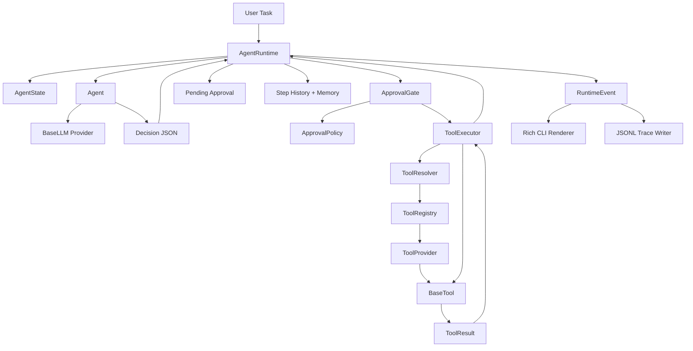
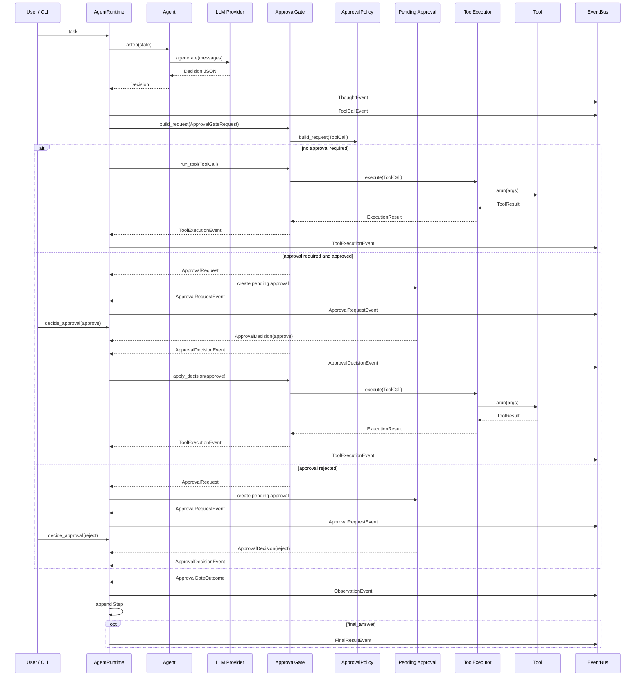

# Architecture

本文档解释 `CodeCraft` 的核心设计。目标是让读者不仅知道代码分了哪些模块，还能理解为什么要这样拆。

## 设计目标

Coding Agent Runtime 的关键职责不是“让模型更聪明”，而是接管模型之外的工程问题：

- **Orchestration**：谁决定下一步执行什么，谁负责循环结束。
- **State management**：历史步骤、当前策略、压缩记忆和最终结果如何维护。
- **Tool governance**：工具调用是否允许，参数是否合法，副作用是否可控。
- **Observability**：每一步执行过程如何被 UI、日志和测试消费。
- **Extensibility**：如何添加新的 LLM provider、新的工具和新的审批规则。

因此项目把 LLM、Runtime、Tool、Approval、Event 分成独立层次。

## 架构图



## 单步执行时序



## 核心模块

### `codecraft.core.runtime.AgentRuntime`

`AgentRuntime` 是唯一的 orchestration owner。

它负责：

- 初始化 `AgentState`
- 驱动 step loop
- 调用 `Agent.astep()` 获取下一轮 `Decision`
- 将 `ToolCall` 交给 `ApprovalGate` 评估
- 创建 pending approval，并通过 `decide_approval()` 恢复已暂停的 step
- 记录 `Step`
- 压缩旧 step 到 memory
- 发出 runtime event
- 在 `final_answer` 后生成 `AgentResult`

Runtime 不直接理解每个工具的业务逻辑，不直接调用 LLM API，也不关心 approval 的细节。它只依赖 `Agent` 和 `ApprovalGate` 两个协作对象。

### `codecraft.core.agent.Agent`

`Agent` 是单 Agent 决策器。

它负责：

- 根据 `AgentState` 构造 prompt
- 注入可用工具 schema
- 注入 `Decision` 输出 schema
- 调用 `BaseLLM.agenerate()`
- 将 LLM 返回内容解析成 `Decision`

当前实现要求 LLM 输出 JSON，并使用 Pydantic `TypeAdapter` 校验结构。

重要边界：

- Agent 每轮只生成一个 `ToolCall`，不执行工具。
- Agent 不能绕过 Runtime 直接访问 Tool。
- Agent 输出不可信，必须由 schema、approval、resolver 和工具参数校验继续约束。

### `codecraft.core.approval_gate.ApprovalGate`

`ApprovalGate` 是工具执行前的 human-in-loop 拦截层。

它负责：

- 调用 `ApprovalPolicy` 判断当前 `ToolCall` 是否需要审批。
- 需要审批时构造 `ApprovalRequestEvent`。
- 根据 Runtime 提交的 approve / reject / edit 决策决定后续动作。
- reject 时返回 rejected `ApprovalGateOutcome`，不调用工具。
- approve 时执行原始 `ToolCall`。
- edit 时执行修改后的 `ToolCall`。
- 发出 `ToolExecutionEvent` 并调用 `ToolExecutor.execute()` 执行已放行的调用。

这样 Runtime 持有暂停和恢复状态，但不需要知道审批规则或拒绝结果如何构造。

### `codecraft.core.tool_executor.ToolExecutor`

`ToolExecutor` 是 Tool 执行入口。

执行顺序：

1. `ToolResolver.resolve()` 根据 tool name 找到具体工具。
2. 工具的 `build_args()` 将原始 `ToolCall.args` 转成实际参数。
3. 调用 `BaseTool.arun()`。
4. 将结果统一包装成 `ExecutionResult`。

ToolExecutor 的价值在于把工具解析、参数构造、执行和异常包装集中起来。Runtime 不需要知道工具执行细节，Tool 也不需要知道审批和调度逻辑。

### `codecraft.tool.base.BaseTool`

`BaseTool` 定义了受控执行单元的生命周期。

一个 Tool 可以声明：

- `name`
- `description`
- `input_schema`
- `preconditions`
- `side_effects`
- `tags`
- `risk_level`
- `generic`
- `idempotent`
- `timeout`
- `max_retries`

`BaseTool.arun()` 统一处理：

- 参数校验
- 同步/异步执行适配
- timeout
- retry
- `ToolException` 归一化
- 任意返回值转 `ToolResult`

这种设计让每个具体工具只需要实现 `execute()` 或 `aexecute()`，不需要重复写校验和错误包装。

### Filesystem workspace

内置文件系统工具继承自 `WorkspaceFileTool`，所有路径都会先解析到 `workspace_root` 内：

- 相对路径会基于 `workspace_root` 解析。
- workspace 内的绝对路径允许访问。
- 通过 `..` 或绝对路径逃逸 workspace 会被拒绝。
- `file_exists` 也会先经过同一套路径解析，避免用存在性检查探测 workspace 外路径。

`create_tool_registry(workspace_root=...)` 可以显式指定 workspace；如果不传，默认使用当前工作目录。

CLI 场景下不会额外暴露 workspace 配置，用户在哪个目录启动 `codecraft`，文件系统工具就被限制在哪个目录内。显式 `workspace_root` 主要服务于测试和程序化嵌入场景。

文件系统工具还会通过 tag 区分操作类型：

- `read`：`read_file`、`file_exists`、`list_dir`
- `write`：`write_file`、`make_dir`、`delete_file`
- `delete`：`delete_file`

这些 tag 后续会被 approval 层用于区分只读、写入和删除操作。

### `codecraft.tool.registry.ToolRegistry`

`ToolRegistry` 负责工具索引。

它只做几件事：

- 从 `ToolProvider` 注册工具
- 检查重复 tool name
- 维护 `name -> tool`
- 维护 `tag -> tool names`
- 输出工具 schema

Registry 不做执行，也不做审批判断。这样职责边界比较清楚。

### `codecraft.policy.approval.ApprovalPolicy`

`ApprovalPolicy` 负责把 `ToolCall` 转换成可选的 `ApprovalRequest`。

当前默认规则很直接：

- `file_exists`、`list_dir`、`read_file` 作为只读工具直接执行。
- `delete_file`、`make_dir`、`shell_exec`、`write_file` 需要人工审批。
- 其他工具默认不需要审批，由工具自身的参数校验和执行边界负责失败处理。

审批通过后，高风险工具仍会限制自己的执行边界。以 `ShellExecTool` 为例：

- 使用 `shell=False` 执行 `shlex.split()` 后的 argv。
- `cwd` 必须位于 workspace 内。
- 过滤环境变量，只保留最小运行环境。
- 非零 returncode 返回失败 `ToolResult`。
- stdout / stderr 会稳定截断。
- 高风险基础命令会在工具层直接拒绝。

后续计划把 approval 从简单规则升级成更完整的治理层：

- 工作目录沙箱
- 路径越权检测
- 写文件 / 删除文件审批
- 更完整的 approval audit log

### `codecraft.core.event_bus.EventBus`

`EventBus` 是 runtime event 的分发器。

Runtime 每个关键阶段都会发出事件：

- `ThoughtEvent`
- `ToolCallEvent`
- `ToolExecutionEvent`
- `ObservationEvent`
- `FinalResultEvent`

CLI 的 `RichRenderer` 只是一个事件订阅者。后续可以增加其他订阅者，例如：

- JSONL trace writer
- WebSocket streamer
- test probe
- metrics collector

## 数据模型

### `AgentState`

`AgentState` 是 runtime 的唯一状态源。

包含：

- `trace_id`
- `task`
- `strategy`
- `current_decision`
- `recent_steps`
- `memory`
- `warnings`
- `final_answer`
- `done`

Runtime 每轮会把新的 `Step` 追加到 `recent_steps`，当历史过长时将较旧 step 压缩成 memory。

### `Decision`

`Decision` 是 Agent 对当前状态的决策结果。

包含：

- `rationale`
- `tool_call`
- `expected_outcome`
- `strategy_note`

Runtime 结束条件是执行到 `final_answer` 工具。

### `ToolCall`

`ToolCall` 是 Agent 每轮输出的单个工具调用请求。

`ToolCall` 包含：

- `tool`
- `args`
- `purpose`

模型只能生成工具调用请求，不能直接获得执行权。

### `Step`

`Step` 是一次工具调用的完整记录。

包含：

- step id
- thought
- tool call
- observation
- success
- summary
- created_at

Step 同时服务于：

- 后续 prompt context
- CLI history
- final result
- memory compression
- trace 持久化的未来扩展

## 扩展一个新工具

添加工具通常需要三步。

第一步，定义参数模型：

```python
from pydantic import BaseModel, ConfigDict, Field


class SearchArgs(BaseModel):
    model_config = ConfigDict(extra="forbid")

    query: str = Field(..., description="搜索关键词")
```

第二步，实现 Tool：

```python
from typing import Any

from codecraft.tool.base import BaseTool


class SearchTool(BaseTool):
    name = "search"
    description = "执行一次搜索。"
    input_schema = SearchArgs
    tags = {"search"}
    risk_level = "low"

    def execute(self, **kwargs: Any) -> dict[str, Any]:
        query = kwargs["query"]
        return {
            "content": f"search result for {query}",
            "data": {"query": query},
        }
```

第三步，通过 Provider 注册：

```python
from typing import Iterable

from codecraft.tool.base import BaseTool
from codecraft.tool.provider import ToolProvider


class SearchProvider(ToolProvider):
    name = "search"

    def tools(self) -> Iterable[BaseTool]:
        return (SearchTool(),)
```

然后传给 `create_tool_registry(providers=[SearchProvider()])`。

## 当前限制

当前版本是一个可运行原型，还不是生产级 runtime。

主要限制：

- `shell_exec` 已支持 CLI 审批和 workspace/cwd 边界，但还没有进程级隔离。
- 已有 JSONL trace 持久化，但还不是可恢复状态存储。
- 目前只有测试内 scripted LLM，还没有可复用的 mock LLM provider。
- 只有单 Agent loop，还没有多 Agent 协作或并行工具执行。
- memory compression 目前只是基于 step summary 的简单滚动压缩。

这些限制会作为后续迭代重点，而不是隐藏起来。它们也是项目继续演进时需要明确讨论的设计空间。
